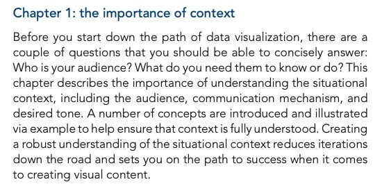

# read aloud the books

Convert PDFs to natural audiobooks by improving early HF TTS models (facebook/mms-tts-eng) via text preprocessing (segmentation, punctuation repair, de-hyphenation, dedup) and audio post-processing (silence trimming, noise reduction, cross-fades), enabling uninterrupted long-form playback.

## demo

[▶️ Play the demo](https://raw.githubusercontent.com/jshuang0520/read_aloud_the_books/master/demo/partial_p29.mp3)

<audio controls preload="none"
       src="https://raw.githubusercontent.com/jshuang0520/read_aloud_the_books/master/demo/partial_p29.mp3">
  Your browser does not support the audio element.
</audio>

